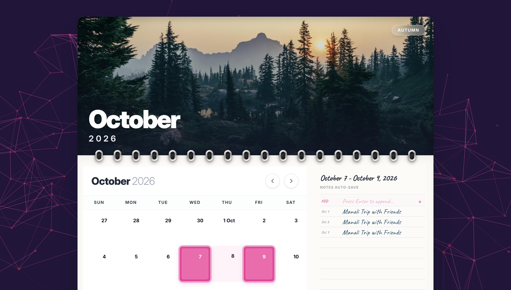

# 📅 Interactive Wall Calendar - Advanced Frontend Challenge



> **Live Demo**: [interactive-calendar-nu.vercel.app](https://frontend-engineering-challenge-inte.vercel.app/)

A premium, highly interactive calendar component built with a "Production-First" mindset. This project pushes the boundaries of standard scheduling UIs by combining a 3D "Spiral Binding" physical aesthetic with cutting-edge React performance patterns.

---

## 🎖️ Special Recognition & Origin Story

This project is a successor to my **Google Calendar Replicate**, which was born out of a high-pressure hackathon during my **first semester of college**. 

During that hackathon (which focused on creating RL environments), I attempted to replicate the full Google Calendar experience. 
- **The Challenge**: Completely "vibe-coded" using **Claude-Max** (provided by the organizers).
- **The Achievement**: Secured the **Runner-Up position** in the Google Calendar category.
- **Legacy Repo**: [Google-Calender](https://github.com/KartikGupta2007/Google-Calender)
- **Legacy Demo**: [google-calender-nu.vercel.app](https://google-calender-nu.vercel.app/)

This current project takes the lessons learned from that high-speed iteration and applies **Senior-level Engineering patterns** to create a cleaner, more performant, and more scalable architecture.

---

## ✨ Core Features

### 🎨 Immersive Visual Experience
- **3D Spiral Binding Layout**: A realistic "physical paper" look that mimics a traditional wall calendar, featuring depth, perspective transforms, and soft drop shadows.
- **Dynamic Seasonal Themes**: The calendar UI (backgrounds, badges, and accents) automatically adapts to the currently viewed month (e.g., Summer Sunset for July, Winter Snow for December).
- **Vanta.js Animated Background**: A fluid, high-performance "Net" animation that brings the interface to life without distracting from the core utility.

### 🖱️ Advanced Interactivity
- **Intelligent Range Selection**: Seamless drag-to-select functionality for multi-day ranges, including normalization logic that handles backward selection.
- **Persistent Notes Grid**: A per-month scratchpad (Notepad style) that persists state using `localStorage`, allowing users to keep monthly goals and reminders alive.
- **Haptic-Feedback Style Hover**: Micro-animations and scale transforms on day cells for a premium, tactile feel.

### ⚡ Technical Excellence (Production Grade)
- **Split-Context Performance Pattern**: Uses dual contexts (`StateContext` and `DispatchContext`) to isolate state updates. This ensures that a re-render in the selection state doesn't trigger unnecessary updates across 40+ grid cells.
- **Component Memoization**: Heavy-duty grid rendering optimized via `React.memo` to maintain 60FPS even during complex mouse/touch interactions.
- **Global Error Handling**: Integrated `ErrorBoundary` to catch edge-case rendering issues without crashing the entire application.

---

## 🛠️ Tech Stack

- **Core**: React 19 + Vite
- **Styling**: Tailwind CSS 4 (Next-gen engine)
- **Animation**: Framer Motion 12
- **Visuals**: Vanta.js + Three.js
- **Date Logic**: date-fns 4
- **Icons**: Lucide React 

---

## 🏗️ Architecture & Project Structure

The codebase follows a modular architecture designed for maintainability and separation of concerns:

```text
src/
├── components/
│   ├── calendar/      # DayGrid, DayCell, Header logic
│   ├── common/        # Reusable ErrorBoundaries, Dividers
│   ├── hero/          # Dynamic seasonal visuals
│   ├── layout/        # Vanta wrapper, 3D Wall container
│   └── notes/         # Persistent Notepad implementation
├── context/           # Split State/Dispatch providers
├── hooks/             # useCalendarGrid logic
└── utils/             # calculateDayFlags, date normalization
```

---

## ⚙️ Installation & Setup

1. **Clone the repository**:
   ```bash
   git clone https://github.com/KartikGupta2007/Frontend-Engineering-Challenge--Interactive-Calendar-Component.git
   ```

2. **Install dependencies**:
   ```bash
   npm install
   ```

3. **Launch local dev server**:
   ```bash
   npm run dev
   ```

4. **Production Build**:
   ```bash
   npm run build
   ```

---

## 🚀 Deployment

Optimized for **Vercel** via `vercel.json` configuration, ensuring smooth SPA routing and high-performance asset delivery.

```json
{
  "framework": "vite",
  "rewrites": [{ "source": "/(.*)", "destination": "/index.html" }]
}
```

---

### Author
**Kartik Gupta**
- GitHub: [@KartikGupta2007](https://github.com/KartikGupta2007)
- Projects: [Interactive Calendar](https://github.com/KartikGupta2007/Frontend-Engineering-Challenge--Interactive-Calendar-Component) | [Google Calendar Clone](https://github.com/KartikGupta2007/Google-Calender)
